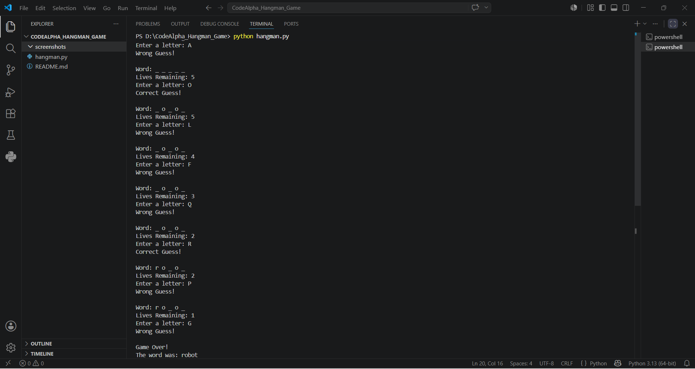

# Hangman Game

A simple text-based Hangman Game built using Python.

## Features

- Random word selection
- 6 lives system
- Input validation
- Duplicate guess checking
- Win/Lose conditions

## Technologies Used

- Python
- VS Code

## Screenshot



## How to Run

```bash
python hangman.py
